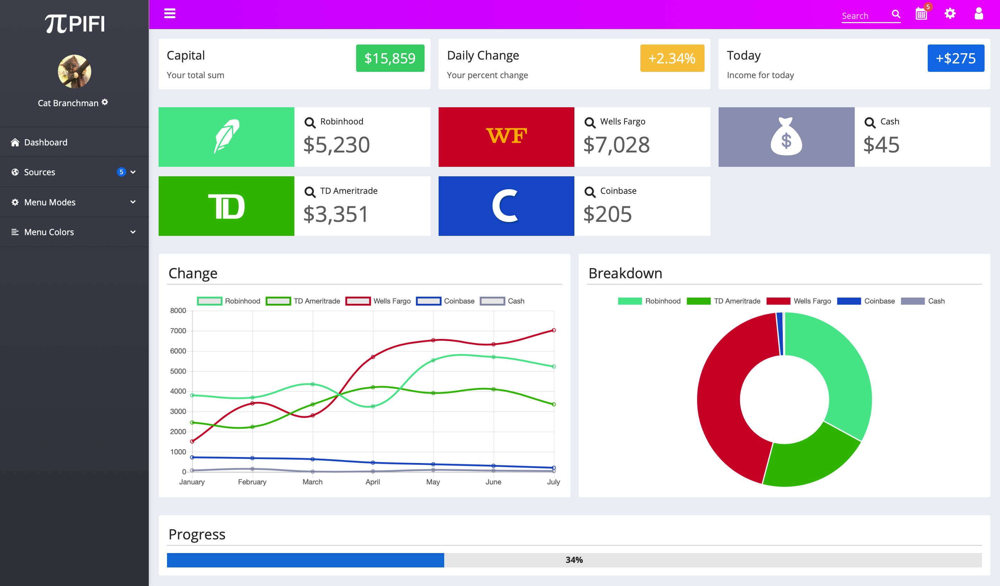

PIFI is a personal finance tracker that says goodbye convoluted spreadsheets. With a simple UI and tools to visualize the metrics that matter most, PIFI will help you to track progress and save that bread.

I'm currently working on PIFI in my free time, and aim to expand this to a publicly hosted tool. For now, my development goals are the following:

- [x] Design dashboard
- [ ] Create Flask API
- [ ] Design login page
- [ ] Other stuff that I haven't thought of yet

Below is a screenshot showing some of my progress so far. All amounts shown below are examples.

This project was bootstrapped with [Create React App](https://github.com/facebookincubator/create-react-app).
